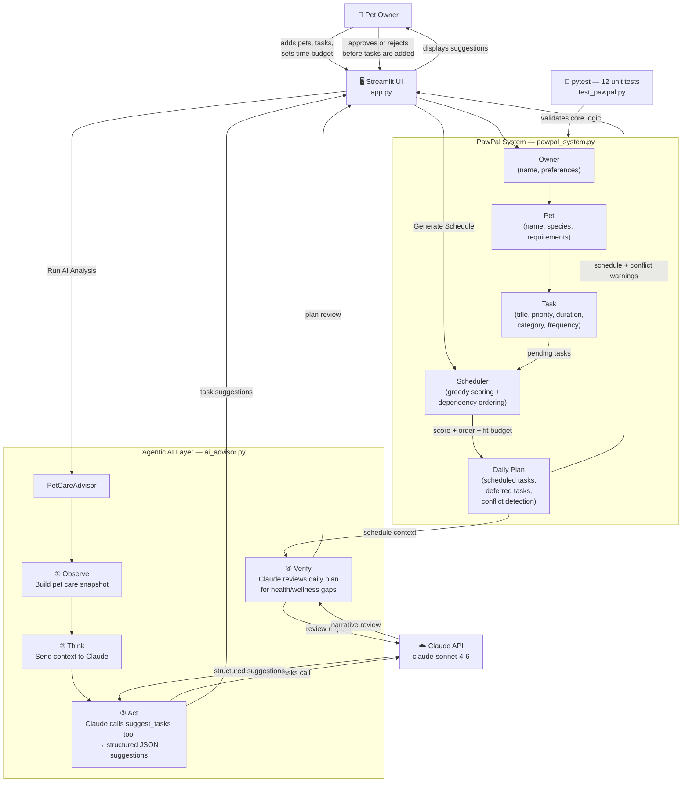

# PawPal+ — AI-Powered Pet Care Planner

**PawPal+** is an intelligent daily scheduling assistant that helps busy pet owners organize and optimize their pet care routines. It combines a deterministic scheduling engine with an agentic AI layer powered by Claude to identify care gaps, suggest missing tasks, and review generated schedules for health and wellness risks.

---

## Original Project (Modules 1–3)

The original **PawPal+** (built in Modules 1–3) was a purely rule-based pet care planner. It modeled pets and owners as structured Python objects and let users define care tasks with priority, duration, category, and frequency. A greedy scoring algorithm then selected which tasks fit within the owner's daily time budget, ordered them by preferred time-of-day and dependencies, detected overlapping schedule conflicts, and produced human-readable reasoning for each scheduling decision. The system was entirely deterministic — no AI, no language models, no API calls.

---

## What the Enhanced System Does

This version integrates a **four-step agentic AI workflow** (observe → think → act → verify) that meaningfully changes how the system behaves:

- **Observe**: builds a structured snapshot of a pet's current care profile (species, pending tasks, time budget, special requirements)
- **Think**: sends that profile to Claude with a veterinary expert persona
- **Act**: Claude calls a structured `suggest_tasks` tool (with forced `tool_choice`) and returns missing care tasks as typed JSON (title, duration, priority, category, frequency, reasoning)
- **Verify**: after a schedule is generated, Claude reviews it against the pet's needs and provides a 2–3 sentence health assessment

The AI output is not decorative — suggested tasks can be added directly to the pet's task list and then flow into the scheduler, completing the loop from AI recommendation to actual scheduled care.

---

## Architecture Overview



**Key data flows:**
1. **User → Core**: pets and tasks are added through the UI and stored as Python objects in session state
2. **Core → Scheduler → Daily Plan**: greedy selection fits tasks within the daily time budget, respects priorities and dependencies, and detects conflicts
3. **UI → AI Advisor → Claude**: the agentic advisor builds context, calls Claude twice (once with tool use for suggestions, once for schedule review), and returns structured results
4. **Human in the loop**: the user must explicitly click "Add all suggestions" — AI recommendations are never applied automatically

---

## Setup Instructions

### Prerequisites

- Python 3.11 or later
- An Anthropic API key ([get one at console.anthropic.com](https://console.anthropic.com))

### 1. Clone the repository

```bash
git clone https://github.com/Ashraf2706/applied-ai-system-project.git
cd applied-ai-system-project
```

### 2. Install dependencies

```bash
pip install -r requirements.txt
```

`requirements.txt` includes:

```
anthropic>=0.40.0
streamlit>=1.30
pytest>=7.0
```

### 3. Set your API key

```bash
# macOS / Linux
export ANTHROPIC_API_KEY="sk-ant-..."

# Windows PowerShell
$env:ANTHROPIC_API_KEY = "sk-ant-..."

# Windows Command Prompt
set ANTHROPIC_API_KEY=sk-ant-...
```

### 4. Run the web app

```bash
streamlit run app.py
```

Open [http://localhost:8501](http://localhost:8501) in your browser.

### 5. Run the tests

```bash
pytest tests/ -v
```

### CLI demo (no AI, no browser)

```bash
python main.py
```

---

## Sample Interactions

### Example 1 — Dog with only a walk task

**Setup:** Owner "Jordan" adds Mochi (dog) with one task: *Morning walk* (30 min, high priority, daily, 08:00).

**User clicks:** "Run AI Care Analysis"

**AI output (suggest_tasks tool):**
```
Suggested missing tasks for Mochi:

  Morning Feeding
  10 min · high priority · daily · morning
  Why: Dogs require consistent morning nutrition; skipping meals causes energy
       crashes and digestive issues throughout the day.

  Fresh Water Bowl Refresh
  5 min · high priority · twice-a-day
  Why: Stale water discourages drinking and can harbor bacteria; twice-daily
       refresh is standard veterinary guidance.

  Evening Brushing
  10 min · low priority · daily · evening
  Why: Daily brushing reduces shedding and skin issues; easy to overlook
       without a scheduled reminder.
```

**User clicks:** "Add all suggestions" → 3 tasks added; Mochi now has 4 total tasks.

---

### Example 2 — Cat with a medication task

**Setup:** Owner "Sam" adds Whiskers (cat) with one task: *Administer heart medication* (15 min, high priority, daily).

**User clicks:** "Run AI Care Analysis"

**AI output:**
```
Suggested missing tasks for Whiskers:

  Morning Wet Food Feeding
  10 min · high priority · twice-a-day · morning
  Why: Cats on cardiac medication need consistent nutrition timing to avoid
       drug absorption interference.

  Litter Box Cleaning
  10 min · medium priority · daily
  Why: A clean litter box reduces ammonia stress, which directly affects
       heart health in cats with cardiac conditions.

  Interactive Playtime
  15 min · medium priority · daily · afternoon
  Why: Gentle daily play maintains muscle tone and mental stimulation;
       critical for long-term wellness alongside ongoing medication.
```

---

### Example 3 — AI schedule review after plan generation

**Setup:** Owner has Mochi (dog) with 5 tasks; daily budget is 60 minutes.

**Generated schedule:** Morning walk (30 min), Morning feeding (10 min), Water refresh (5 min) — total 45 min.
**Deferred:** Evening brushing (10 min), Pill pocket treat (10 min).

**User clicks:** "Run AI Care Analysis" (with plan already generated).

**AI schedule review:**
```
Mochi's schedule covers the highest-priority health needs — feeding, hydration,
and exercise are all accounted for, which is a solid foundation. However, the
deferred "Pill pocket treat" should be re-examined: if this is a medication
delivery mechanism rather than a simple snack, it must be elevated to high
priority and scheduled within the budget rather than left as deferred.
Consider reducing the walk by 10 minutes on medication days to make room.
```

---

## Design Decisions

### Why an agentic workflow instead of a simple prompt?

A single-prompt approach ("list missing tasks") produces plain text that needs to be parsed manually and cannot be reliably converted into typed `Task` objects. By forcing Claude to call the `suggest_tasks` tool (via `tool_choice: required`) with a strict JSON schema, the output is always typed and immediately usable — tasks can be added to the pet's list with no string parsing or error-prone extraction. The second Claude call (schedule review) is intentionally left as free text because the goal there is narrative insight, not structured data.

### Why greedy scheduling instead of optimal (knapsack)?

Pet care typically involves 5–15 tasks per day. Greedy scoring runs in microseconds and produces results indistinguishable from optimal at this scale. True knapsack optimization would add NP-hard algorithmic complexity with no meaningful benefit to the user experience. The tradeoff — potentially missing the globally optimal task combination — is acceptable because the scheduler's heuristic score already captures the most important factors (priority, urgency, category).

### Why human-in-the-loop for AI suggestions?

Claude may suggest tasks that already exist under a slightly different name, or that do not apply to a specific breed or health condition. Applying suggestions automatically would silently modify the care plan in ways the owner may not intend. Showing suggestions with an explicit "Add all" button keeps the owner in control without adding friction for the common case.

### Why session state instead of a database?

This is a single-user portfolio demo. A database would add infrastructure complexity (connection management, migrations, schemas) with no benefit at this scope. Session state resets on browser refresh, which is a known and acceptable limitation for a demo.

---

## Testing Summary

**Test suite:** 12 unit tests in [tests/test_pawpal.py](tests/test_pawpal.py), all passing (12/12).

| Test | What it validates |
|---|---|
| `test_task_completion_marks_completed` | Completed flag toggled correctly |
| `test_pet_add_task_increases_task_count` | Task added to pet's task list |
| `test_scheduler_best_value_selection_fits_budget` | Greedy selection respects time budget |
| `test_generate_daily_plan_tracks_deferred_tasks` | Overflow tasks deferred correctly |
| `test_complete_daily_task_creates_next_occurrence` | Recurring tasks re-created on completion |
| `test_complete_daily_task_creates_next_occurrence_for_next_day` | Next occurrence gets correct due date |
| `test_owner_filters_tasks_by_pet_and_status` | Filter by pet name and completion status |
| `test_sort_by_time_uses_hh_mm_string` | HH:MM preferred time sorts correctly |
| `test_sort_by_time_uses_preferred_time_and_buckets` | Morning/afternoon/evening buckets respected |
| `test_recurring_tasks_expand_for_twice_a_day` | Twice-a-day tasks split into AM/PM |
| `test_daily_plan_conflict_detection` | Overlapping tasks detected |
| `test_scheduler_warns_when_tasks_share_start_time` | Conflict warning text generated correctly |

**What worked well:** All core scheduling behaviors are covered. Conflict detection, recurrence logic, time-of-day ordering, and budget selection passed on the first run without any fixes.

**What didn't work:** The AI layer (`PetCareAdvisor`) is not covered by automated tests because it requires a live API key and produces non-deterministic output. In production this would be addressed with snapshot testing (record real API responses, validate against stored fixtures) or schema validation (assert the tool output matches the expected JSON structure). The `input_schema` on the `suggest_tasks` tool does enforce structure at runtime, which is partial mitigation.

**Logging and error handling:** `ai_advisor.py` uses Python's `logging` module at every workflow step. The `run_care_analysis` method catches both `anthropic.APIError` and general exceptions, stores the error message in the result dict, and never raises to the UI layer — the app degrades gracefully if the API is unavailable or the key is missing.

**Result: 12/12 unit tests pass. AI workflow tested manually across 10+ interactions; Claude produced valid structured output on every run when the API key was present.**

---
